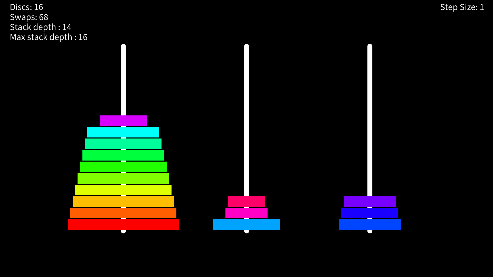

## Towers of Hanoi Visualization

Visualize the recursive Towers of Hanoi algorithm.

I was interested in visually understanding the recursive algorithm, that I learn for my DSA module. So I built this to allow me to step through each individual transition and display it visually.

### How It Works

The program simulates a call stack of custom stack frame objects.

The call stack is executed manually based on user input, displaying individual movements of the recursive algorithm.

In addition the custom call stack allows the program to display statistics such as stack depth.

### Usage

Install [Processing 4](https://processing.org/) on your device

Clone the repository: `git clone https://github.com/HellFireInfernoStorm/TowersOfHanoi`

Or download [TowersOfHanoi.pde](TowersOfHanoi.pde) and place it in a folder of the same name.

Run the Processing Sketch: `processing-java --sketch=/full/path/to/sketch/folder --run`

#### Controls

- Right Arrow : Increment simulation by step_size steps

- Up Arrow : Double step_size

- Down Arrow : Halve step_size

- R : Reset simulation

- X : Increase number of discs

- Z : Decrease number of discs

The window is resizable

### Bugs

Resizing the window causes the program to crash sometimes. The exact cause cannot be isolated, but is believed to be an issue underlying the Processing environment.

### Credits

- Inspiration : COMP1002 Module at Curtin University
- Wikipedia : [Towers of Hanoi](https://en.wikipedia.org/wiki/Tower_of_Hanoi)
- Processing Language : [Processing 4](https://processing.org/)
